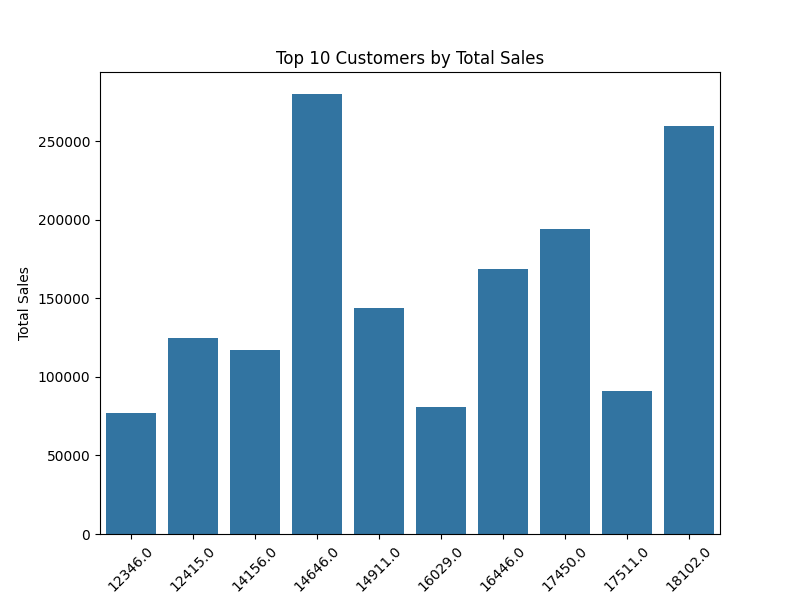

# Customer Purchase Behavior Analysis

## Overview
This Python project analyzes the "Online Retail Dataset" to identify customer purchasing patterns, top-selling products, and sales trends. It uses data manipulation and visualization techniques to provide actionable insights for retail businesses. The project was developed using Jupyter Notebook and documented on GitHub as part of a portfolio to showcase data analysis skills.

## Features
- Loads and cleans the "Online Retail Dataset" (over 500,000 transactions).
- Calculates total sales per customer, identifying the top 10 customers (e.g., highest sales of £280,206).
- Identifies the top 10 products by quantity sold.
- Generates visualizations (bar charts) to illustrate customer and product trends.

## Technologies Used
- **Language**: Python
- **Libraries**: 
  - Pandas (data manipulation)
  - Matplotlib and Seaborn (visualization)
- **Environment**: Jupyter Notebook
- **Dataset Source**: [Kaggle](https://www.kaggle.com/datasets/vijayuv/onlineretail)

## Installation/Setup
1. Install Python from [python.org](https://www.python.org).
2. Install required libraries : pip install pandas matplotlib seaborn
3. Download the "Online Retail Dataset" from [Kaggle](https://www.kaggle.com/datasets/vijayuv/onlineretail).
- Save it as `online_retail.csv` in the project folder.
4. Open `customer_analysis.ipynb` in Jupyter Notebook and run the cells : jupyter notebook
5. Ensure the working directory contains `online_retail.csv` for the script to load the data.

## Files
- `customer_analysis.ipynb`: Jupyter Notebook with the full analysis and visualizations.
- `top_customers.png`: Bar chart of the top 10 customers by total sales.
- `top_products.png`: Bar chart of the top 10 products by quantity sold.
- `README.md`: This documentation file.

## Screenshots
  
  

*Note: These visualizations enhance the understanding of customer and product trends.*

## Insights
- The top customer (`CustomerID: 14646.0`) contributed £280,206.02 in total sales.
- The best-selling product was likely "WHITE HANGING HEART T-LIGHT HOLDER" (quantity may vary based on dataset).
- The analysis highlights significant purchasing power among a small group of customers.

## Future Improvements
- Add time-series analysis to identify sales trends over time.
- Implement customer segmentation using clustering (e.g., K-means).
- Create an interactive dashboard with Plotly or Streamlit.
- Optimize the code for larger datasets.

## Contact
- **Author**: Shubhangi Vishwakarma
- **GitHub**: [ShubhiV13](https://github.com/ShubhiV13)
- **Email**: vishwakarmashubhangi75@gmail.com

## License
This project is open-source under the MIT License.
